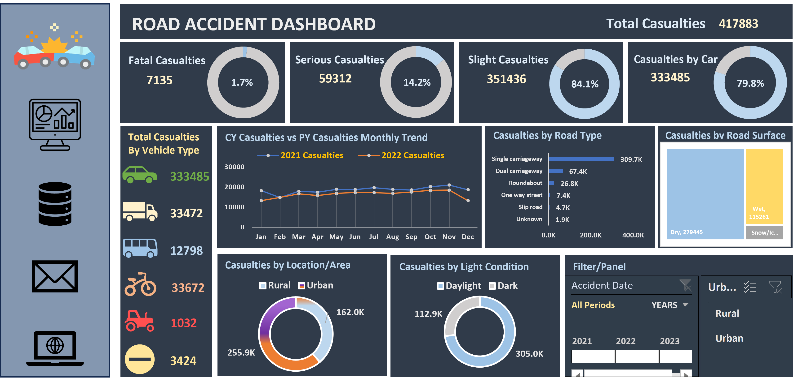

# End-to-End Data Analysis Project: Traffic Casualty Insights & Business Intelligence Dashboard
## Project Overview:
This project demonstrates an end-to-end data analysis workflow, transforming raw traffic accident data into actionable insights.

Using Microsoft Excel, the data was processed and analyzed to discover key trends related to accident severity, vehicle involvement, environmental conditions, and temporal patterns.

The primary objective of this project is to showcase practical data analytics skills relevant to finance and logistics environments, where data-driven decision-making, trend analysis, and performance monitoring are critical.
## Business Problem

Road traffic accidents remain a major public safety concern, leading to significant loss of life, injuries, and economic costs. However, the key factors driving these incidents are not always clear. This project analyzes accident data to identify patterns and insights that can support better road safety decisions.

The objective is to:

* Identify the primary causes of high casualty rates
* Understand how factors like road type, lighting, and surface conditions influence accidents
* Detect temporal trends (monthly and yearly)
* Provide insights to support targeted road safety improvements
## Dataset Overview:
- Number of records: **307,973** rows
- Number of fields: **24** columns
- Each row represents: A single road accident case
## Methodology:

**Data Cleaning:** Removed duplicates, corrected inconsistencies, and standardized categorical values.  

**Data Preparation:** Created helper columns and grouped categories to enhance analysis.  

**Data Analysis:** Used Pivot Tables to analyze casualty patterns across key variables and time trends.  

**Data Visualization:** Built an interactive Excel dashboard with charts and slicers for dynamic insights. 
## Key Metrics:
- Total Casualties: **417K**  
- Fatal Casualties: **7.1K**  
- Fatality Rate: **1.7%**  
- % Casulaties by Car : **79.8%**
## Dashboard Preview:

An interactive dashboard visualizing road accident trends and casualty distribution.
## Skills:
- Data cleaning and standardization
- Data transformation (feature engineering in Excel)
- Exploratory data analysis (Pivot Tables)
- Data visualization and dashboard creation
- Excel (advanced functions, filters & slicers)
## Results & Recommendations:
- Total casualties were 417K, with fatal cases at 7.1K (1.7%).
- Cars accounted for 79.8% of all casualties.
- Single carriageway roads had the highest casualties.
- Most accidents occurred on dry roads (279K cases).
- Daylight conditions recorded the highest casualties.
- Casualties were higher in 2021 than 2022, with similar monthly patterns.

**Recommendations**
- Target safety measures for car-related accidents.
- Improve safety on single carriageway roads.
- Focus awareness campaigns during daylight traffic periods.
- Investigate why accidents are high on dry road conditions.
- Continue monitoring yearly trends for policy evaluation.
## Next Steps:

